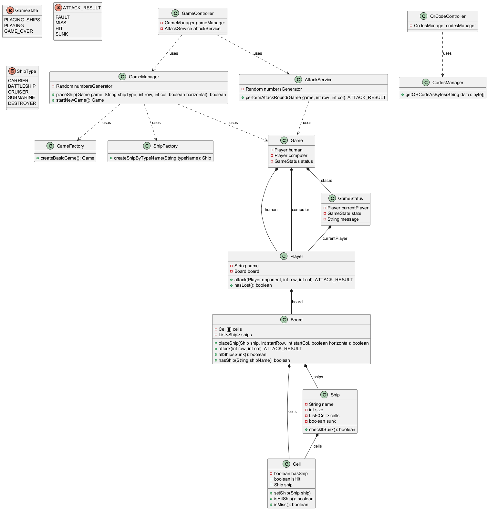

# Battleship Game

A web-based implementation of the classic Battleship game built with Spring Boot, where you play against an Computer opponent.

## Description

This project is a simple web application that allows users to play Battleship against a computer. The game includes ship placement, turn-based attacks, and a clean web interface using Thymeleaf templates.
Computer opponent randomly places its ships and attacks the player's board. The game continues until one player sinks all of the opponent's ships.

## Features

- **Ship Placement**: Place your fleet of ships (Carrier, Battleship, Cruiser, Submarine, Destroyer) on a 10x10 grid.
- **Interactive Board**: Click on cells to set ship positions or attack the Computer's board.
- **Computer Opponent**: The computer Computer randomly places ships and attacks your board.
- **Game States**: Handles ship placement phase, active gameplay, and game over.
- **Web Interface**: Responsive HTML interface with CSS styling.

## Technologies Used

- **Java 25**
- **Spring Boot 4.0.5** (Web MVC, Thymeleaf, Actuator, DevTools)
- **Thymeleaf** for server-side templating
- **Maven** for dependency management
- **HTML/CSS/JavaScript** for frontend

## Prerequisites

- Java 25 or higher
- Maven 3.6+ (or use the included Maven wrapper)

## How to Run

1. **Clone the repository** (if applicable) or navigate to the project directory.

2. **Build the project**:
   ```bash
   mvn clean install
   ```
   Or using the Maven wrapper:
   ```bash
   ./mvnw clean install
   ```

3. **Run the application**:
   ```bash
   mvn spring-boot:run
   ```
   Or:
   ```bash
   ./mvnw spring-boot:run
   ```

4. **Open your browser** and go to `http://localhost:8080`.

5. Click "Start Game" to begin playing.

## Gameplay Instructions

1. **Start**: Visit the home page and click "Start Game".
2. **Place Ships**: Select a ship type, enter row/column coordinates (0-9), choose orientation (horizontal/vertical), and submit. You can also click on the board cells to auto-fill the row and column inputs.
3. **Attack**: Once all ships are placed, click on the computer's board to attack. The computer will counter-attack automatically.
4. **Win Condition**: Sink all of the opponent's ships to win. The game ends when one player's fleet is destroyed.
5. **New Game**: Start over at any time.

## Architecture Diagram

Below is the UML class diagram for the Battleship project:




## Project Structure

- `src/main/java/com/gra/statki/`: Java source code
  - `StatkiApplication.java`: Main Spring Boot application class
  - `controller/GameController.java`: Handles web requests and game logic
  - `model/`: Game model classes (Board, Cell, Game, Player, Ship)
- `src/main/resources/templates/`: Thymeleaf HTML templates
- `src/main/resources/static/js/`: JavaScript files
- `pom.xml`: Maven configuration

## Contributing

Feel free to fork the repository and submit pull requests for improvements or bug fixes.

## License

This project is open-source. See the pom.xml for any license information.
